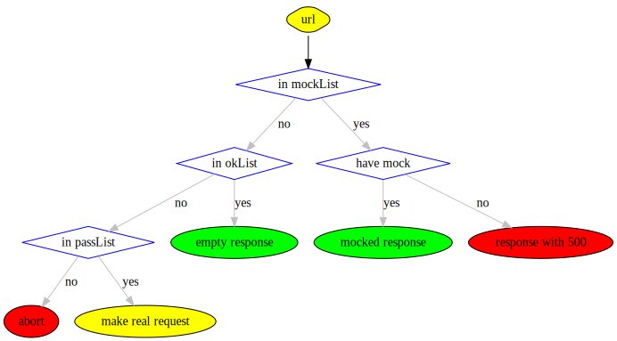

# teremock

## Do I need that thing?

If you are writing puppeteer tests, and you want to mock your network responses easily – probably yes.

## How to use

```js
import mocker from 'teremock'

await mocker.start()

// async stuff which is making requests

await mocker.stop()
```

## How it works

First, `teremock` intercepts puppeteers page requests and tries to find its body in mocks folder. Generated filename depends on `url`, `method` and `postBody` – so, you always know, do you have a mock for that particular request or not. If you have it – you will get it as a response, instantly. If not – request will go to the real backend (see also: mockList and okList).

Second, `teremock` intercepts all responds, and writes them to the filesystem, if they are not on it already. In case of `CI` (if mock was not found), it uses mockMiss middleware, so you could be sure – all your requests are mocked (or build will fail otherwise).

## Pipeline



## API

You could use `options`
```js
mocker.start(options)
```
All options are optional (that's why they called so).
```js
const options = {
  // Absolute path to working directory, where you want to store mocks
  // path.resolve(process.cwd(), '__teremocks__') by default
  wd: __dirname,

  // puppeteer page
  // global.page by default
  page: page,

  // In some cases you could have some random GET params, which are not affect the response body
  // but several params may be important for you (White List)
  // [] by default
  queryParams: ['important'],

  // In some cases you could have some random GET params, which are not affects the response body
  // but could lead to `always out of date` mocks (Black List)
  // [] by default
  skipQueryParams: ['randomId', 'timestamp'],

  // Same as skipQueryParams but for post body params
  // Only application/json MIME type is supported
  skipPostParams: [
      'randomId',
      'timestamp',
      ['objectParameter', 'property']
  ],

  // Probably you dont want to mock some requests (e.g. cdn js files)
  // And you definitely dont want to mock your webapp requests (e.g. localhost/app.js)
  // So, you could explicitly whitelist urls you want to mock
  // _all except localhost_ if both – mockList and okList – were not set
  // Could be an array, or a `,` delimited string
  mockList: 'my-backend.org/used/by/test',

  // It is recommended to explicitly mock only _critical-for-your-test_ urls
  // But you could also mock with simple 200-OK response some other requests,
  // which are not critical, but should be intercepted
  // (to prevent ddos-effect to your real backend, for example)
  // All items from mockList have higher priority over okList
  // Could be an array, or a `,` delimited string
  okList: ['my-backend.org/not/critical/for/test'],

  // If url not in mockList, nor okList, it will be blocked, unless any of two conditions
  // 1) url is same origin, and method is GET
  // 2) url is matched agains any string in passList
  // By default, block any cross origin and non-GET same-origin requests
  passList: [],

  // Run as CI if true. That means, your tests will fail if any of the requests were not mocked
  // Default is `is-ci` package value (same as in Jest)
  ci: require('is-ci'),

  // A middleware to call when mock is not found on the file system
  // Works only in CI mode
  // Possible values are:
  // 1) CODE (number) – respond with CODE http code for any unmocked request (e.g. 200)
  // 2) 'throw' (string) – will throw an error
  // 3) (next) => next(anyResponse) - respond with anyResponse object
  // default value is: 500
  // Note: request is not available in the middleware function
  // Note: body must be a string (use JSON.stringify for objects)
  mockMiss: (next) => next({ code: 200, body: JSON.stringify({ foo: 'bar' }) }),

  // Set true, to await all non-closed connections when trying to stop mocker
  // Warning: some tests could became flaky
  awaitConnectionsOnStop: false,

  // Custom headers or/and body or/and status for ANY request from the mockList
  // All keys in the object are optional (e.g. you could change only status code)
  // Usefull with combination of mocker.set() method
  // Warning! It is not working in the mocks generation mode! So, first, create your mocks.
  // See also https://github.com/puppeteer/puppeteer/issues/599
  response: {
    headers: { 'Access-Control-Allow-Origin': '*' },
    body: 'OK',
    status: 200,
  },
}
```
Both `mocker.start()` and `mocker.stop()` return a `Promise`.

## mocker.set()

You could temporary change any option and then get back to its initial value.

For example:

```js
mocker.set('response', { status: 427 })
const result = await doRequest()
expect(result).toBe('Server responded with an error, status code is 427')
// note: headers and body will be taken from the mocks, only status code is changed
mocker.unset('response) // or mocker.reset()
```
