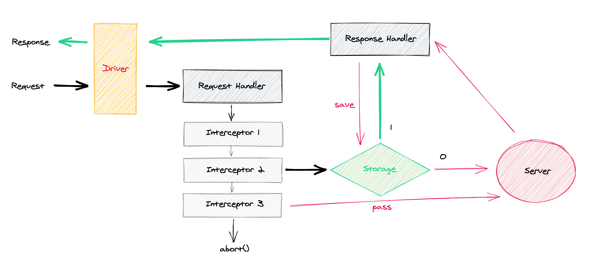

> Now with Playwright support!

# teremock

## Do I need teremock?

If you write puppeteer / playwright / karma tests, and you want to mock your network responses easily – probably yes.

## How to use with playwright (experimental)

```js
import { Teremock, PlaywrightDriver } from 'teremock'

const teremock = new Teremock({ driver: new PlaywrightDriver({ page }) })
await teremock.start({ page })

// async stuff which is making requests, including redirects
```

## How to use with puppeteer

```js
import teremock from 'teremock'

await teremock.start({ page })

// async stuff which is making requests, including redirects
```

## How to use with mocha / karma

```js
// server-side
import teremock from 'teremock/express/server'

await teremock.listen({
  app: expressApp,
  env: { myApi: 'http://example.com/api' },
})

// client-side
// make sure, you configured your test app to make request
// `<test-app-host>/myApi` instead of `http://example.com/api`
import teremock from 'teremock/express'

await teremock.start()

// async stuff which is making requests, excluding redirects
```

## How it works



First, `teremock` intercept request (all xhr/fetch requests by default). Then, it looks for the mock file. If mock file exist, you get response from it. If not, request goes to the real backend.

Second, `teremock` intercepts all responds, and writes them to the **filesystem** as mock files,

### or not.

Sometimes it is more convenient to set mocks right in tests, without storing them to the file system. For that cases mocker.add method exist.

Example:
```js
mocker.add(interceptor)
```
After that line, all request, matched `interceptor`, will be mocked with `interceptor.response`.

> Note: dynamically added interceptors have priority over statically added interceptors. Also, latter `mocker.add` interceptors have higher priority. _See [interceptor](#interceptor) below_.

## options

```js
mocker.start(options)
```
All options are optional (that's why they called so), except `page` for puppeteer, and `app / env` for express.

```js
const options = {
  // Puppeteer options
  page: page,

  // Express options
  app: express(),
  env: { myApi: 'http://example.com/api' },

  // Common options

  // Named list of request interceptors
  interceptors: {
    testpage: {
      url: 'localhost',
      pass: true
    },
    example_com_api: {
      url: 'example.com',
      methods: `get,post`,
    },
    my_another_api: {
      url: '/path/to/my/api',
      response: async (request) => ({
        status: 200,
        headers: {},
        body: request.query
      })
    },
    option_requests: {
      methods: 'option',
      response: {
        headers: {
          'allow-origin': '*'
        }
      }
    },
  },

  // Absolute path to working directory, where you want to store mocks
  // path.resolve(process.cwd(), '__teremocks__') by default
  wd: path.resolve(__dirname, '__teremocks__'),

  // Run as CI if true. In CI mode any non-passable request will not go to the real backend
  // Default is `is-ci` package value (same as in Jest library)
  ci: false,

  // Extends values for any mocked response
  // You could redefine any response property, including headers, body and ttfb
  responseOverrides: {
    // A sequence of ttfb values
    // Each new request will get the next (looped) ttfb value
    // Could be usefull when find flaky tests and race conditions
    // In this example, all requests (first 10) will work as a stack, not as a queue
    ttfb: [900, 800, 700, 600, 500, 400, 300, 200, 100, 0]
  },

  onStop: ({ matched }) => {
    // `matched` contains data about all urls and matched interceptors since last `start()`
  }
}
```

## Interceptor

Interceptor – is a big conception in `teremock`. Interceptor is an object, which have two different groups of properties:

1. Matcher group: these properties determine, whether to intercept particular request, or not.
2. Provider group: what to do with request: 1) pass to real backend 2) respond with inline resoponse 3) try to find response mock on file system.

Interceptor is used, if _all_ matchers are matched against request. So, if one matcher is not matched, given interceptor will not be used.

It is recommended to have interceptors for all possible (for your test app) requests. All non-covered requests will be aborted.

### Matcher group properties

#### interceptor.`url` [string]

A string, which defines urls to match. It works when `request.url.includes(url) === true` – so, `ample.com` will match both `http://exampe.com` and `https://not-example.com/api?foo-bar`. Note: prefer not to place query params to urls, because they could be randomly sorted in real request.

Default value: `*`.

#### interceptor.`resourceTypes` [string]

Comma-separated list of puppeteer [request resource types](https://github.com/puppeteer/puppeteer/blob/master/docs/api.md#requestresourcetype). By default, only `xhr` and `fetch` request are mockable, but there are many situation where you may want to mock html documents, js files and, for example, the whole page of the facebook auth.

Default value: `xhr,fetch`.

#### interceptor.`query` [Object]

Unsorted one-level object of query params. Missing params will not affect the interception. Example: `{ foo: 'bar' }` will match `<url>?foo=bar` as well as `<url>?alice=bob&foo=bar&baz=1`.

Duplicated values (e.g. `?foo=bar&foo=baz`) are not supported.

Default value: `{}`.

#### interceptor.`methods` [string]

Comma-separated list of http methods to be matched. Example: `get,post,put`.

Default value: `*`.

#### interceptor.`headers` [Object]

Unsorted one-level ignore-cased object of _request_ headers.

Default value: `{}`.

#### interceptor.`body` [Object]

Unsorted deep object to match request body.

Default value: `{}`.

### Provider group properties

#### interceptor.`pass` [boolean]

If `true`, pass request to the real backend. It is not recommended to pass any request outside of your app, since your tests became unstable and dependent from backends stability and network availability.

Default value: `false`.

#### interceptor.`response` [Object | Function]

If present, it is used instead of file-based mocks. Usefull for testing different responses for the same request, and/or for mocking big-sized data.

Functional interceptor response must be async (return Promise), which must resolve with full response object (e.g. `{ headers: {}, status: 200, body: ... }`). Use functional interceptors when you need dynamic behaviour (e.g. translate random cookie to random GET param). Dont use functional interceptors for handling too many different requests or as a router between mocks.

Default value: `null`.

#### interceptor.`naming` [Object]

See [Change naming rules](https://github.com/Diokuz/teremock#change-naming-rules) below.

[Interceptor examples](./examples/interceptors.js).

## Mock files naming

The name of mock file is consist of five parts:

#### 1. `options.wd` value

#### 2. named directory

Name will be taken from interceptor.name, or from the interceptor key, or from the hostname+path of request.url.

#### 3. lowercased http method

e.g. `post`

#### 4. query or three words

If request method is `get`, and query is short enough, it is used. Otherwise, three words are used. These words are pseudorandom, and depends on a) request url (without query) b) query params (sorted, deduped) c) body params (sorted).

#### 5. `.json` extension.

@todo examples

### Change naming rules

In many cases it is important to be independent from some query and body params, which, for example, have random value for each requests (e.g. timestamp). There are four different list for skipping some parameters, when calculating mock filename: whitelist and blacklist for query and body parameters.

For example, you want to skip `timestamp` GET-parameter, `randomToken` and nested `data.wuid` POST-parameters. Then, you need to construct two lists, and set them to mocker options:

```ts
const dynamicQueryParams = [
  'timestamp'
]
const dynamicBodyParams = [
  'randomToken',
  ['data', 'wuid']
]

const interceptor = {
  naming: {
    query: {
      blacklist: dynamicQueryParams
    },
    body: {
      blacklist: dynamicBodyParams
    }
  }
})
```
Now, when you have a POST request with url and body:
```
http://example.com/?foo=bar&timestamp=123

{
  randomToken: 'qweasd',
  data: {
    alice: 'bob',
    wuid: 32
  }
}
```
the mock filename will be exact as if it were just
```
http://example.com/?foo=bar

{
  data: {
    alice: 'bob'
  }
}
```

It is not recommended to use `whitelist`, because you may encounting mocks filenames collision. But in some rare cases (for example, when some keys are random) `whitelist` could be usefull.

It is not possible to use different lists for different urls simultaneously, but if you really need that, just create an issue!

## API methods

### mocker.start()

Starts the mocker. Mocks for all requests matched `options.capture` will be used, but no mocks used before `mocker.start()` and after `mocker.stop()`

Both `mocker.start()` and `mocker.stop()` return a `Promise`.

### mocker.stop()

Stops teremock, removes all handlers from puppeteer, disables request interception.

### mocker.add(interceptor)

Adds new interceptor to teremock in the middle of a test. Interceptor have priority over `interceptors`, defined in teremock.start(). To remove it, just call function which was returned:

```ts
const remove404 = mocker.add({ url: 'example.com', response: { status: 404 } })
// ... request for 'example.com' → check 404 behaviour here
remove404()

const remove500 = mocker.add({ url: 'example.com', response: { status: 500 } })
// .. same request for 'example.com' → check 500 behaviour here
remove500()
```

Note: in most cases you dont need dynamic interceptors – it is better to write two different tests.

### mocker.spy(interceptor)

Example:

```ts
const spy = mocker.spy({ url: 'example.com', query: { id: '123' } })
await stuff()
expect(spy.calledOnce).toBe(true)
spy.dismiss()
```

## Debug

`teremock` uses `debug` library for hidden logs, and `signale` library for warning and error logs.

Warnings and errors are printed unconditionally (all the time).

Debug logs are hidden, but could be switched on with enviroment variable `DEBUG` with valies, started with `teremock...`. For example: `DEBUG=teremock* yarn jest`.

### Trace

Use `DEBUG=teremock:trace ...` for tracing your request. Sample output:

```
teremock:trace http://localhost:3000/api?foo=bar&baz=1 ← page.on('request') fired +0ms
teremock:trace http://localhost:3000/api?foo=bar&baz=1 ← handling request +0ms
teremock:trace http://localhost:3000/api?foo=bar&baz=1 ← mock not found in storage +1ms
teremock:trace http://localhost:3000/api?foo=bar&baz=1 ← request.continue() +0ms
teremock:trace http://localhost:3000/api?foo=bar&baz=1 → page.on('response') fired +37ms
teremock:trace http://localhost:3000/api?foo=bar&baz=1 → handling response +53ms
teremock:trace http://localhost:3000/api?foo=bar&baz=1 → storing mock basic--get-foo-bar +1ms
teremock:trace http://localhost:3000/api?foo=bar&baz=1 → finish +1ms
```

## How to intercept request on a new page (e.g. popup)?

It is not possible right now with puppeteer. Looking forward for https://github.com/puppeteer/puppeteer/issues/443.

## Brief review of mockers

### Puppeteer based mockers

This type of mockers (which teremock belongs to) could mock any client-side request, including xhr, fetch, script, images, redirect pages. But 1) cannot mock websockets 2) cannot mock server-side request 3) cannot mock initial request of new page.

1. Teremock

### Server-side (nodejs) mockers

This type of mockers have one fundamental limitation: you have to be in the same nodejs process. This type of mockers wont work for you if your app runs in a separate process (including child process), than your testing framework.

1. [Nock](https://github.com/nock/nock#readme) ← simple and powerfull mocker, which decorates native http.request and http.ClientRequest functions.

### Separate mocked real endpoints

This type of mockers allows you to test your system very close to the real network topology, but only if you could configure all your endpoints (change real urls to your mocked endpoints).

1. [MockIt](https://github.com/boyney123/mockit)  ← allows fastly create stub endpoints. It is better in cases when you have isomorphic applications, and you have requests both – on server and on client-side.
